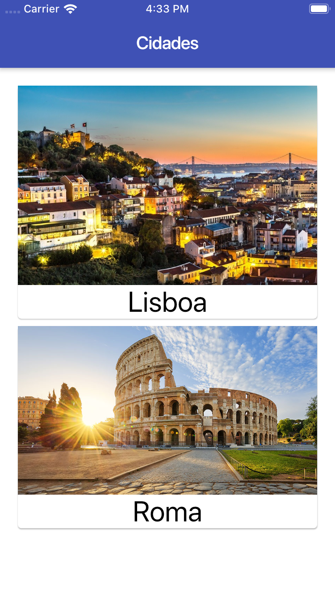
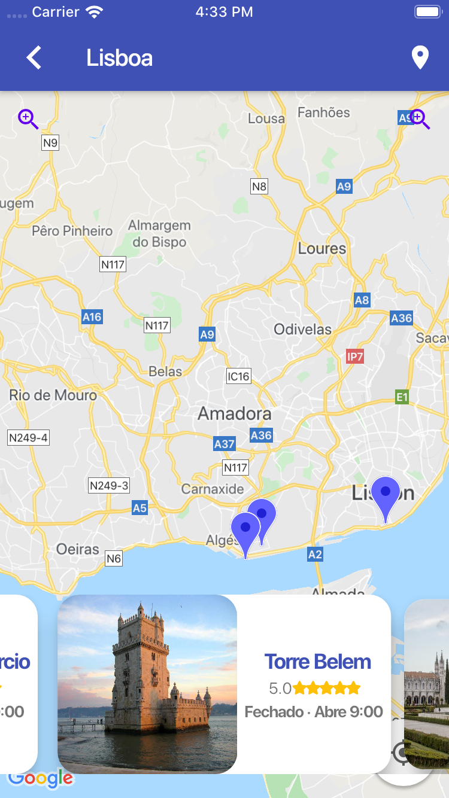

# Mapas e Cidades
App simples de cidades que mostra os pontos turísticos de um mapa.

Utiliza um mock de json que coloquei aqui como API:
http://www.mocky.io/v2/5db35e0a300000500057b628

## Projeto utiliza:

* RxDart : https://pub.dev/packages/carousel_slider
* Animações com AnimatedContainer e SlideTransition.

## prints

